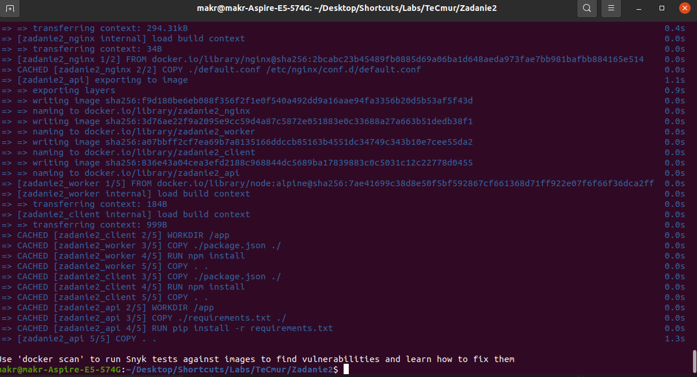
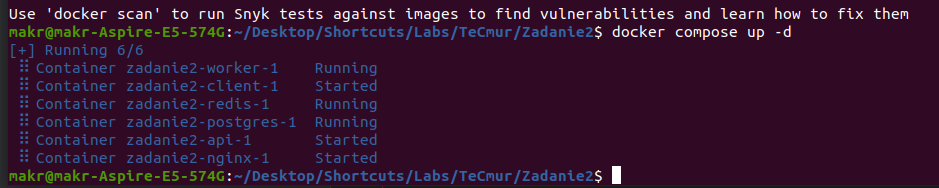

# Technologii Chmurowe
## Zadanie 2
## Mark Zaianchkovskyi

### Co było zmienione?
Został przepisany kod servery w języku Python.  
Niestety backend nie używa nginxa.  
I modyfikowany kod servera i clienta według zadania, czyli z ciągu Fibonacci na ciąg Geometryczny  

### Strona dokumentacji (nie bardzo ładna)

### Strona z wyliczeniami

### Backendowy swagger

### Diagram architektury

### Server
Server powstał na innym hoscie i powinny być dostępny za adresem  
`127.0.0.1:5555`

### Budowanie i uruchomienie
Na wersjach produkcyjnej i developerskiej wynik jest ten sam  
- Dla tego żeby zbuildować obrazy skorzystamy z polenia:  
`docker compose build` | `docker compose -f docker-compose.dev.yml build` 
- Uruchomienie  
`docker compose up -d` | `docker compose -f docker-compose.dev.yml up -d` 
- Jeśli coś poszło nie tak  
`docker compose restart` | `docker compose -f docker-compose.dev.yml restart` 
Często były problemy z uruchomieniem servera,  
często był włączany przed bazą danych, chociaż zależności są zalecane
- Usunięcie  
`docker compose down`  
 
Nawet pracuje  
  

### P.S
Zdecydowałem umieścic wszystko w jednym pliku readme  
<strong>Bardzo przepraszam za spóżnienie w oddaniu pracy</strong>  
