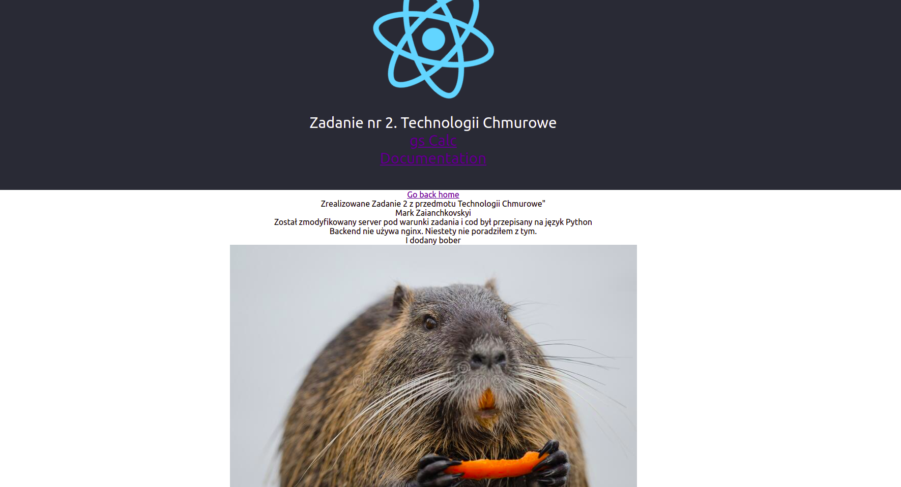
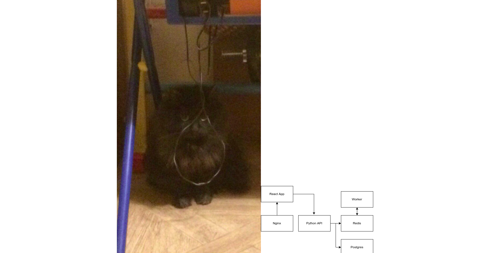
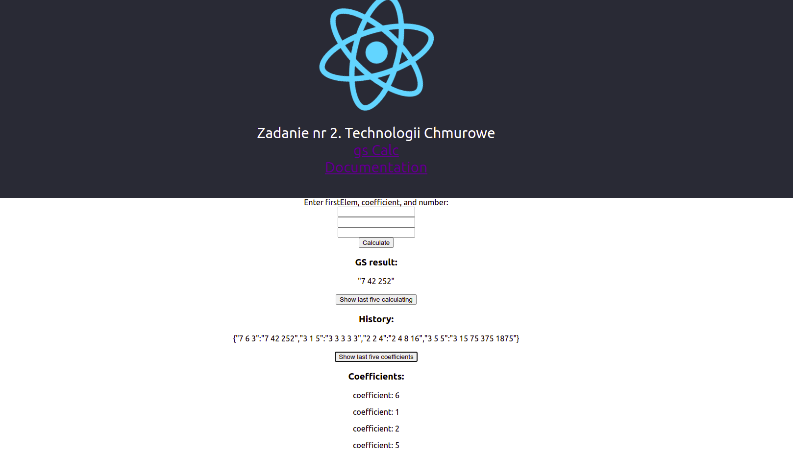
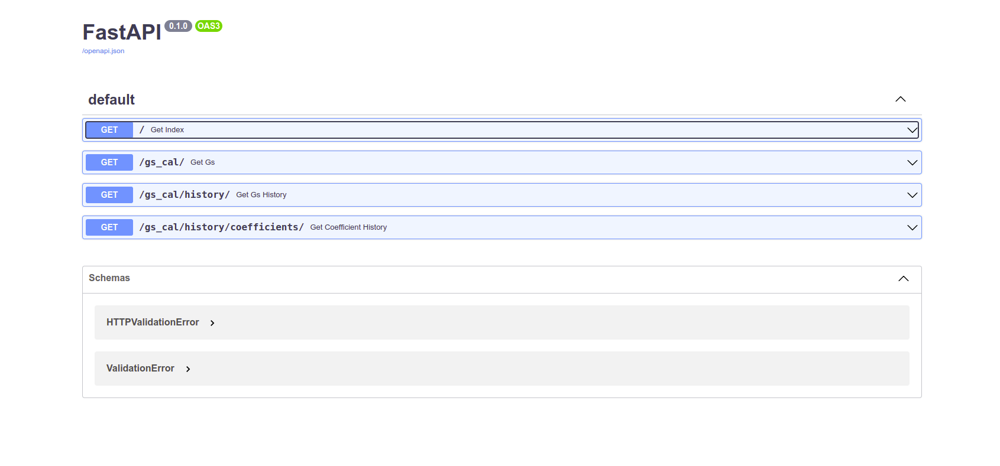
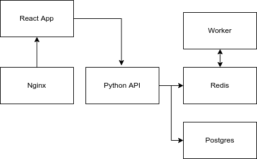

# Technologii Chmurowe
## Zadanie 2
## Mark Zaianchkovskyi

### Co było zmienione?
Został przepisany kod servery w języku Python.  
Niestety backend nie używa nginxa.  
I modyfikowany kod servera i clienta według zadania, czyli z ciągu Fibonacci na ciąg Geometryczny  

### Strona dokumentacji (nie bardzo ładna)

### Strona z wyliczeniami

### Backendowy swagger

### Diagram architektury

### Server
Server powstał na innym hoscie i powinny być dostępny za adresem  
`127.0.0.1:5555`

### P.S
Zdecydowałem umieścic wszystko w jednym pliku readme  
<strong>Bardzo przepraszam za spóżnienie w oddaniu pracy</strong>  
